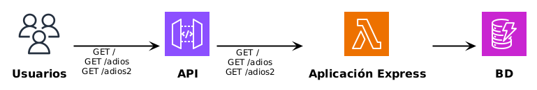
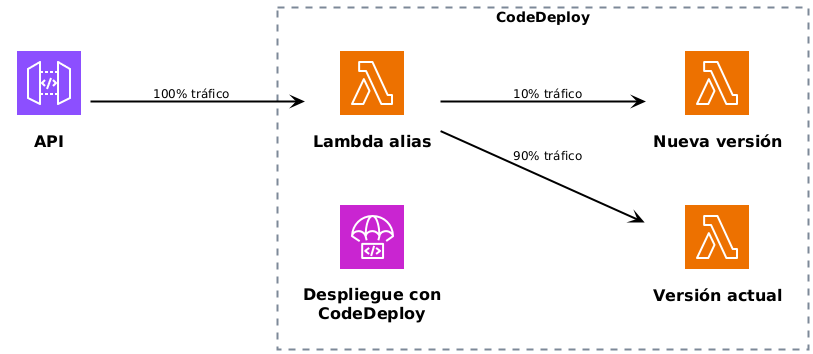
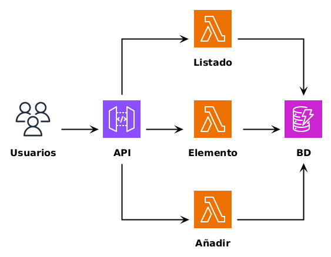
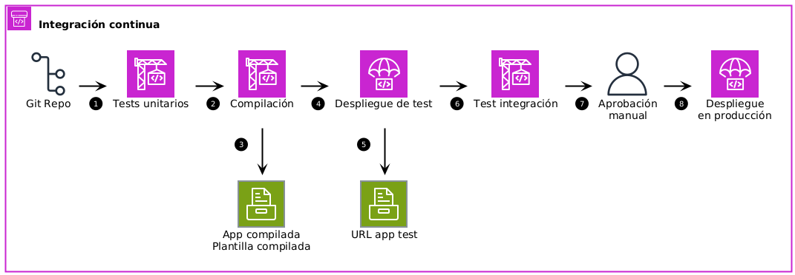
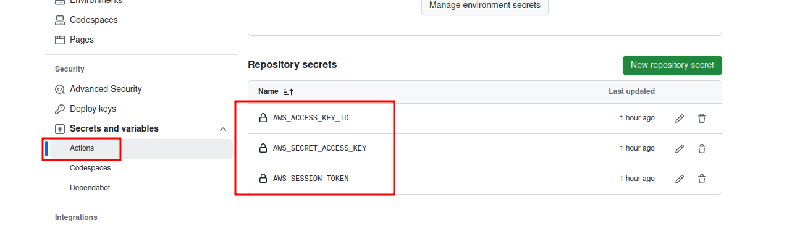

# AWS SAM

En esta práctica os proponemos dos arquitecturas para trabajar con **AWS SAM** (*Serverless Application Model*), un framework para desarrollar aplicaciones serverless en AWS.

AWS SAM incluye:

-   Una **extensión** de la sintaxis de CloudFormation, incorporando un **conjunto de recursos de alto nivel** que simplifican la creación de **aplicaciones serverless**
-   Una herramienta **CLI**, que permite la **creación**, el **testeo** y el **despliegue** de aplicaciones serverless

La primera arquitectura propuesta despliega una **API REST con acceso a datos**. El despliegue se realiza mediante la estrategia **blue/green**: la versión actual en producción y la nueva versión conviven durante un período de tiempo en el que el tráfico se va migrando progresivamente, monitorizando posibles errores que permitan abortar el despliegue (*rollback*) o completar la transición.

El segundo proyecto despliega una aplicación web a través de mecanismos de **Integración Continua** y **Entrega Continua** (CI/CD). Para ello se utiliza el servicio GitHub Actions junto con la herramienta SAM para realizar el despliegue en **dos etapas**. En un primer paso, la aplicación se despliega en una **infraestructura de pruebas** que permite la realización de tests manuales y **tests de integración**. En un segundo paso, tras autorizar la transición de manera manual, la aplicación se despliega en **producción**.


## Despliegue API REST blue/green

En este apartado realizaremos el despliegue blue/green de una API REST a través de la herramienta SAM.

En este caso se ha elegido desarrollar una aplicación a través del framework **Express** de NodeJS, un framework que permite crear **APIs REST**. Así, será la propia aplicación la que mapee las rutas y los métodos a los recursos correspondientes. Como alternativas, en otros lenguajes de programación tendríamos Laravel (PHP) o SpringBoot (Java).




### Plantilla

Puedes ver el código de la plantilla en el fichero [template.yaml](./bluegreen/template.yaml) del repositorio.

<details> <summary> Pulsa para ver el contenido del fichero </summary>

```yaml
AWSTemplateFormatVersion: 2010-09-09
Description: >-
  Ejemplo de aplicacion web para desplegar una API REST con AWS SAM

# Indicamos que vamos a utilizar una plantilla SAM
Transform:
  - AWS::Serverless-2016-10-31

Parameters:
  # El parámetro Stage nos permitirá crear las etapas de staging y production
  Stage:
    Type: String
    AllowedValues:
      - staging
      - production
  # Nombre de la API en API Gateway
  ApiName:
    Type: String
    Default: sam-cefire

Resources:
  MyApi:
    Type: AWS::Serverless::Api
    Properties:
      Name: !Sub "${ApiName}-${Stage}"
      StageName: !Ref Stage
      Variables:
        LAMBDA_ALIAS: !Ref Stage

  CanaryErrorsAlarm:
    Type: AWS::CloudWatch::Alarm
    Properties:
      AlarmDescription: Alarma para detección de problemas en Canary
      ComparisonOperator: GreaterThanThreshold
      EvaluationPeriods: 2
      MetricName: Errors
      Namespace: AWS/Lambda
      Period: 60
      Statistic: Sum
      Threshold: 0
      Dimensions:
        - Name: Resource
          Value: !Sub "${lambdaFunction}:${Stage}"
        - Name: FunctionName
          Value: !Ref lambdaFunction
        - Name: ExecutedVersion
          Value: !GetAtt lambdaFunction.Version.Version

  lambdaFunction:
    Type: AWS::Serverless::Function
    Properties:
      Role: !Sub arn:aws:iam::${AWS::AccountId}:role/LabRole
      FunctionName: !Sub "${Stage}-cefire-sam-main"
      AutoPublishAlias: !Ref Stage
      Handler: handler.handler
      CodeUri: ./src/apifunction/
      Runtime: nodejs22.x
      Architectures:
        - x86_64
      MemorySize: 128
      Timeout: 10
      Environment:
        Variables:
          tableName: !Ref SampleTable
          stage: !Ref Stage
      DeploymentPreference:
        # Opciones: https://docs.aws.amazon.com/serverless-application-model/latest/developerguide/automating-updates-to-serverless-apps.html
        # Type: Canary10Percent10Minutes
        Type: Linear10PercentEvery1Minute
        Role: !Sub arn:aws:iam::${AWS::AccountId}:role/LabRole
        Alarms:
        # Lista de alarmas que se comprobarán durante la actualización a nueva versión
          - !Ref CanaryErrorsAlarm
      Events:
        ProxyApiRoot:
          Type: Api
          Properties:
            RestApiId: !Ref MyApi
            Path: /
            Method: ANY
        ProxyApiGreedy:
          Type: Api
          Properties:
            RestApiId: !Ref MyApi
            Path: /{proxy+}
            Method: ANY

  # Tabla DynamoDB
  SampleTable:
    Type: AWS::Serverless::SimpleTable
    Properties:
      TableName: !Sub "${Stage}-cefire-sam-tabla"
      PrimaryKey: 
        Name: PK
        Type: String

# Ajustes globales
Globals:
  Function:
    Tags:
      project: cefire-sam
      environment: !Ref Stage
  Api:
    # Para evitar crear las etapas por defecto de la API
    OpenApiVersion: 3.0.1
    Cors:
      AllowMethods: "'GET,POST,PUT,OPTIONS'"
      AllowHeaders: "'content-type'"
      AllowOrigin: "'*'"
Outputs:
  ApiEndpoint:
    Description: "URL de la API"
    Value: !Sub "https://${MyApi}.execute-api.${AWS::Region}.amazonaws.com/${Stage}/"
  DynamoDBTable:
    Description: "Tabla DynamoDB"
    Value: !Ref SampleTable
```

</details>


### Parámetros

Los parámetros permiten la configuración de los recursos con datos proporcionados por el usuario que despliegue la plantilla. Esta plantilla incluye los siguientes:

-   `Stage` - Nombre de la etapa de despliegue. Los valores válidos serán `staging` y `production`
-   `ApiName` - Nombre de la API que se creará en el servicio API Gateway


### Recursos

Los recursos que se crearán son:

-   **API** - Recurso de tipo [AWS::Serverless::Api](https://docs.aws.amazon.com/serverless-application-model/latest/developerguide/sam-resource-api.html). Crea una API en el servicio API Gateway que actuará como punto de entrada a la aplicación. Este recurso puede ser implícitamente creado (tal como se indica en la segunda arquitectura propuesta), pero en este caso vamos a especificarlo para crear una etapa de despliegue con un nombre concreto. Incluye las siguientes **propiedades**:
    -   `Name` - Nombre de la API
    -   `StageName` - Nombre de la etapa de despliegue. Hace referencia al parámetro `Stage`
    -   `Variables/LAMBDA_ALIAS` - Crea una variable de entorno que hace referencia al **Alias** de la función Lambda al que se dirigirá el tráfico.
-   **Alarma** - Alarma de CloudWatch que se encarga de detectar errores en la ejecución de la función Lambda. Está configurada para detectar la presencia de como mínimo dos errores en un intervalo de 60 segundos.
-   **Función Lambda** - Recurso de tipo [AWS::Serverless::Function](https://docs.aws.amazon.com/serverless-application-model/latest/developerguide/sam-resource-function.html). Crea una **función Lambda** que ejecutará la lógica de la aplicación, en este caso la aplicación creada con NodeJS y Express. Este recurso, propio de SAM, permite definir **no solo la función Lambda**, sino también **la interconexión con la API**. Incluye las siguientes **propiedades**:
    -   `Role` - Rol de ejecución, que definirá los **permisos** que el código de la función tendrá para interactuar con otros recursos de AWS. En el caso de AWS Academy, utilizamos `LabRole`
    -   `FunctionName` - El nombre de la función
    -   `AutoPublishAlias` - Este [parámetro](https://docs.aws.amazon.com/serverless-application-model/latest/developerguide/sam-resource-function.html#sam-function-autopublishalias) establece que cada vez que se actualice el código se creará una **nueva versión**, y que dicha versión estará accesible a partir de un **alias**. Este alias se utilizará para conectar el tráfico proveniente de la API. Además, se utilizará para **conmutar progresivamente el tráfico** entre la versión actual y la nueva versión desplegada.
    -   `Handler` - Ruta al punto de entrada del código. `handler.handler` hace referencia al archivo `handler.mjs` y a la función `handler` definida en su interior
    -   `CodeUri` - Ruta a la carpeta del código de la función
    -   `Runtime` - Entorno de ejecución, que en este caso es NodeJS v22
    -   `MemorySize` - RAM asignada a la función
    -   `Timeout` - Tiempo máximo de ejecución de la función, para impedir un coste excesivo en caso de que el código no finalice correctamente
    -   `Environment` - Variables de entorno disponibles para el código de la función. En este caso se definen dos: una que hace referencia a la tabla DynamoDB y otra al nombre de la etapa a desplegar.
    -   `Events` - Define la **conexión de la función con la API**. En este caso se realiza una integración de tipo **proxy**, donde **todas las peticiones HTTP** se **reenvían** para su procesado por la función Lambda.
    -   `DeploymentPreference` - [Estrategia de despliegue](https://docs.aws.amazon.com/serverless-application-model/latest/developerguide/automating-updates-to-serverless-apps.html). En este caso utilizaremos una estrategia blue/green de despliegue lineal de un 10% cada 1 minuto. Para ello se utilizará el **alias** de la función: **el tráfico que se envíe al alias se enviará de manera ponderada a la versión actual y a la nueva versión**. Para ello se utilizará el servicio **CodeDeploy**. También se hace referencia a la **alarma** creada anteriormente, que se utilizará para detectar si hay errores y de esta manera continuar con el proceso de conmutación de tráfico o abortarlo.
        
        


### Globals

En esta sección se indican algunos ajustes globales, como la configuración `CORS` y el ajuste `OpenApiversion`, para evitar crear las etapas por defecto en el recurso de API Gateway.


### Outputs

Como salida, se indica la URL de la API y el nombre de la tabla DynamoDB.


### Tareas propuestas

1.  Acceder a la carpeta `./bluegreen/src/apifunction`
2.  Instalar las dependencias del proyecto:
    
    ```bash
    npm install
    ```
3.  Ejecutar los tests unitarios:
    
    ```bash
    npm run test
    ```
4.  Testear la aplicación local, sin utilizar SAM ni AWS:
    
    ```bash
    npm run start
    ```
5.  Volver a la carpeta `./bluegreen`
6.  Desplegar el stack mediante el comando siguiente:
    
    ```bash
    sam deploy --guided
    ```
    
    Seguir las indicaciones y elegir un nombre de etapa (`Stage`) para desplegar la aplicación. Acceder a la URL y comprobar el funcionamiento. Las rutas definidas son:
    
    ```
    /
    /?nombre=VALOR
    /adios
    ```
7.  Modificar el código de la aplicación, fichero `index.mjs`, e introducir un cambio (se propone uno marcado como `TODO 1`).
8.  Desplegar de nuevo la aplicación
9.  Acceder a CodeDeploy en la consola de AWS y comprobar el estado de migración del tráfico. Comprobar que los porcentajes se van actualizando cada 1 minuto.
10. Acceder a la función Lambda en la consola de AWS. Consultar el alias y comprobar los porcentajes de tráfico asignados a las diferentes versiones. Comprobar que coinciden con los valores de CodeDeploy y que los porcentajes se van actualizando cada 1 minuto.
11. Lanzar varias peticiones a la ruta raíz de la API. Puedes hacerlo a través del navegador, pulsando `F5` varias veces repetidamente. Comprobar que en alguno de los casos el mensaje que se muestra es el nuevo, mientras que en la mayoría es el antiguo. Comprobar que cuando finaliza la transición, todas las peticiones devuelven el mensaje nuevo.
12. Modificar de nuevo el código de la aplicación, fichero `index.mjs`, y **eliminar el código** de la ruta `/adios`, para que se produzca un error de ejecución en la nueva versión a desplegar de la función Lambda (marcado como `TODO 2`).
13. Desplegar de nuevo la aplicación
14. Acceder a CodeDeploy en la consola de AWS y comprobar el estado de migración del tráfico. Comprobar que los porcentajes se van actualizando cada 1 minuto.
15. Acceder a la función Lambda en la consola de AWS. Consultar el alias y comprobar los porcentajes de tráfico asignados a las diferentes versiones. Comprobar que coinciden con los valores de CodeDeploy y que los porcentajes se van actualizando cada 1 minuto.
16. Lanzar varias peticiones a la ruta de la API (`/adios`). Puedes hacerlo a través del navegador, pulsando `F5` varias veces repetidamente. Comprobar que en alguno de los casos se muestra el texto (versión actual), mientras que en ocasiones **se muestra un error** (nueva versión con error incluido). Estos errores serán registrados por la alarma de CloudWatch, que monitoriza **los errores de la nueva versión desplegada**, y provocarán un **rollback**, interrumpiendo el despliegue y volviendo a la versión anterior.
17. Acceder a CloudWatch y comprobar que la alarma que hemos creado se ha activado
18. Acceder a CodeDeploy y comprobar que el despliegue se ha abortado y se ha realizado un **rollback**

Realiza una breve memoria donde incluyas capturas de cada uno de los pasos realizados.

De manera completamente opcional, puedes **desplegar tu propia aplicación web** realizando los cambios que consideres necesarios en la plantilla propuesta.


## Despliegue API REST CI/CD

En este segundo apartado desplegaremos una aplicación desde una pila de integración continua, CI/CD, utilizando el servicio de **GitHub Actions** y la herramienta **SAM**.

En este caso se ha elegido desarrollar la aplicación mediante una **arquitectura de microservicios**, sin utilizar ningún framework de tipo Express, como en el caso anterior. Aquí, será el servicio **API Gateway** el que realice la distribución del tráfico y lo reenvíe a **diferentes funciones lambda de backend**.




### Plantilla

Puedes ver el código de la plantilla en el fichero [template.yaml](./cicd/template.yaml) del repositorio. Este código está basado en un BluePrint de AWS SAM, *Serverless API*.

<details> <summary> Pulsa para ver el contenido del fichero </summary>

```yaml
AWSTemplateFormatVersion: 2010-09-09
Description: >-
  Aplicación de ejemplo basada en el BluePrint de AWS SAM, Serverless API
Transform:
- AWS::Serverless-2016-10-31

Resources:
  getAllItemsFunction:
    Type: AWS::Serverless::Function
    Properties:
      # Rol de laboratorio de AWS Academy
      Role: !Sub arn:aws:iam::${AWS::AccountId}:role/LabRole
      Handler: src/handlers/get-all-items.getAllItemsHandler
      Runtime: nodejs18.x
      Architectures:
      - x86_64
      MemorySize: 128
      Timeout: 100
      Description: A simple example includes a HTTP get method to get all items from
        a DynamoDB table.
      Environment:
        Variables:
          # Variable de entorno para identificar la tabla de la BD
          SAMPLE_TABLE: !Ref SampleTable
      Events:
        Api:
          Type: Api
          Properties:
            Path: /
            Method: GET
  getByIdFunction:
    Type: AWS::Serverless::Function
    Properties:
      # Rol de laboratorio de AWS Academy
      Role: !Sub arn:aws:iam::${AWS::AccountId}:role/LabRole
      Handler: src/handlers/get-by-id.getByIdHandler
      Runtime: nodejs18.x
      Architectures:
      - x86_64
      MemorySize: 128
      Timeout: 100
      Description: A simple example includes a HTTP get method to get one item by
        id from a DynamoDB table.
      Environment:
        Variables:
          # Variable de entorno para identificar la tabla de la BD
          SAMPLE_TABLE: !Ref SampleTable
      Events:
        Api:
          Type: Api
          Properties:
            Path: /{id}
            Method: GET
  putItemFunction:
    Type: AWS::Serverless::Function
    Properties:
      # Rol de laboratorio de AWS Academy
      Role: !Sub arn:aws:iam::${AWS::AccountId}:role/LabRole
      Handler: src/handlers/put-item.putItemHandler
      Runtime: nodejs18.x
      Architectures:
      - x86_64
      MemorySize: 128
      Timeout: 100
      Description: A simple example includes a HTTP post method to add one item to
        a DynamoDB table.
      Environment:
        Variables:
          # Variable de entorno para identificar la tabla de la BD
          SAMPLE_TABLE: !Ref SampleTable
      Events:
        Api:
          Type: Api
          Properties:
            Path: /
            Method: POST
  SampleTable:
    Type: AWS::Serverless::SimpleTable
    Properties:
      PrimaryKey:
        Name: id
        Type: String
      ProvisionedThroughput:
        ReadCapacityUnits: 2
        WriteCapacityUnits: 2

Outputs:
  WebEndpoint:
    Description: API Gateway endpoint URL for Prod stage
    Value: !Sub "https://${ServerlessRestApi}.execute-api.${AWS::Region}.amazonaws.com/Prod/"
Globals:
  Api:
    Cors:
      AllowMethods: "'GET,POST,PUT, OPTIONS'"
      AllowHeaders: "'content-type'"
      AllowOrigin: "'*'"
```

</details>


### Recursos

Los recursos que se crearán son:

-   **Funciones Lambda** - Recursos de tipo [AWS::Serverless::Function](https://docs.aws.amazon.com/serverless-application-model/latest/developerguide/sam-resource-function.html). Se crearán tres funciones Lambda, `getAllItemsFunction`, `getByIdFunction` y `putItemFunction`.
    -   Cada una de ellas será ejecutada por una ruta y un método HTTP en la API, definidos en su propiedad `Events`.
    -   Las funciones incluyen una variable de entorno para acceder a la tabla de DynamoDB, que será la base de datos
-   `SampleTable` - Tabla de DynamoDB que actuará como base de datos de la aplicación.
-   **API** - En este caso, no se define ningún recurso de tipo API. Sin embargo, AWS SAM lo creará de [manera implícita](https://docs.aws.amazon.com/serverless-application-model/latest/developerguide/sam-specification-generated-resources-function.html#sam-specification-generated-resources-function-api) a través de las funciones y sus eventos conectados. De esta manera, se consigue tener una **plantilla más concisa**.


### Integración continua

Se proporciona un fichero de ejemplo, `pipeline.yaml`, con los diferentes trabajos que se realizarán cada vez que se suba un nuevo cambio al repositorio.



Puedes ver su contenido en el fichero [pipeline.yaml](./cicd/pipeline.yaml) del repositorio.

<details> <summary> Pulsa para ver el contenido del fichero </summary>

```yaml
name: Pipeline

on:
  push:
    branches:
      - 'master'
      - 'main'

env:
  # Plantilla de Infraestructura como Código (IaC). Define los recursos a crear
  SAM_TEMPLATE: template.yaml
  # Nombre del conjunto de recursos desplegados para testeo
  TESTING_STACK_NAME: todo-app-dev
  # Región donde desplegar la infraestructura de testeo
  TESTING_REGION: us-east-1
  # Nombre del conjunto de recursos desplegados para producción
  PROD_STACK_NAME: todo-app-prod
  # Región donde desplegar la infraestructura de producción
  PROD_REGION: us-east-1
  # ARN del rol "LabRole" del laboratorio de AWS
  # Utilizado por las funciones Lambda (backend) para poder acceder a la base de datos
  LAB_ROLE_ARN: ${{ vars.LAB_ROLE_ARN }}

permissions:
  id-token: write
  contents: read

# Tareas del pipeline
jobs:
  # Tarea 1: tests unitarios
  test:
    runs-on: ubuntu-latest
    steps:
      - name: Clonar repositorio
        uses: actions/checkout@v3
      - name: Instalar dependencias
        run: npm install
      - name: Lanzar tests unitarios
        run: npm run test

  # Tarea 2: Compilación y empaquetado de la aplicación
  build-and-package:
    needs: [test]
    runs-on: ubuntu-latest
    steps:
      - name: Clonar repositorio
        uses: actions/checkout@v3
      - name: Eliminar carpeta de tests para reducir tamaño
        run: rm -rf ./__tests__
      - name: Instalar dependencias de producción únicamente
        run: npm prune --production
      - name: Instalar SAM CLI
        uses: aws-actions/setup-sam@v2
        with:
          use-installer: true

      - name: Compilar aplicación
        run: sam build --template ${SAM_TEMPLATE} --use-container

      - name: Configurar credenciales AWS
        uses: aws-actions/configure-aws-credentials@v4
        with:
          aws-access-key-id: ${{ secrets.AWS_ACCESS_KEY_ID }}
          aws-secret-access-key: ${{ secrets.AWS_SECRET_ACCESS_KEY }}
          aws-session-token: ${{ secrets.AWS_SESSION_TOKEN }}
          aws-region: ${{ env.TESTING_REGION }}

      - name: Empaquetar aplicación para testeo y compilar plantilla
        run: |
          sam package \
            --region ${TESTING_REGION} \
            --output-template-file packaged-testing.yaml

      - name: Almacenar plantilla de testeo compilada para el siguiente paso
        uses: actions/upload-artifact@v4
        with:
          name: packaged-testing.yaml
          path: packaged-testing.yaml

      - name: Empaquetar aplicación para producción y compilar plantilla
        run: |
          sam package \
            --region ${PROD_REGION} \
            --output-template-file packaged-prod.yaml

      - name: Almacenar plantilla de producción compilada para el siguiente paso
        uses: actions/upload-artifact@v4
        with:
          name: packaged-prod.yaml
          path: packaged-prod.yaml

  # Tarea 3: Despliegue de aplicación en infraestructura de test
  deploy-testing:
    needs: [build-and-package]
    runs-on: ubuntu-latest
    outputs:
      ApiUrl: ${{ steps.GetUrl.outputs.ApiUrl }}
    steps:
      - name: Instalar SAM CLI
        uses: aws-actions/setup-sam@v2
        with:
          use-installer: true
      - name: Obtener plantilla de test almacenada en el paso anterior
        uses: actions/download-artifact@v4
        with:
          name: packaged-testing.yaml

      - name: Configurar credenciales AWS
        uses: aws-actions/configure-aws-credentials@v4
        with:
          aws-access-key-id: ${{ secrets.AWS_ACCESS_KEY_ID }}
          aws-secret-access-key: ${{ secrets.AWS_SECRET_ACCESS_KEY }}
          aws-session-token: ${{ secrets.AWS_SESSION_TOKEN }}
          aws-region: ${{ env.TESTING_REGION }}

      - name: Despliegue de aplicación en infraestructura de test
        run: |
          sam deploy --stack-name ${TESTING_STACK_NAME} \
            --template packaged-testing.yaml \
            --capabilities CAPABILITY_IAM \
            --region ${TESTING_REGION} \
            --no-fail-on-empty-changeset \
            --parameter-overrides "LabRoleArn=${LAB_ROLE_ARN}"
      - name: Obtener URL de la API desplegada para almacenarla en el paso posterior
        id: GetUrl
        run: |
          {
            echo 'ApiUrl<<EOF'
            sam list stack-outputs \
              --stack-name ${TESTING_STACK_NAME} \
              --region ${TESTING_REGION} \
              --output json |  jq -r ".[0].OutputValue"
            echo EOF
          } >> "$GITHUB_OUTPUT"

  # Tarea 4: Test de integración en infraestructura de test
  integration-test:
    needs: [deploy-testing]
    runs-on: ubuntu-latest
    env:
      ApiUrl: ${{needs.deploy-testing.outputs.ApiUrl}}
    steps:
      - name: Clonar repositorio
        uses: actions/checkout@v3
      - name: Instalar dependencias
        run: npm install
      - name: Ejecutar test de integración
        run: |
          ApiUrl=$ApiUrl npm run integracion

  # Tarea 5: Despliegue de aplicación en infraestructura de producción
  deploy-prod:
    needs: [integration-test]
    runs-on: ubuntu-latest
    # Configurar un GitHub Action Environment para activar una aprobación manual
    # https://docs.github.com/en/actions/reference/environments
    environment: testenv
    steps:
      - name: Instalar SAM CLI
        uses: aws-actions/setup-sam@v2
        with:
          use-installer: true
      - name: Obtener plantilla de producción almacenada en el paso anterior
        uses: actions/download-artifact@v4
        with:
          name: packaged-prod.yaml

      - name: Configurar credenciales AWS
        uses: aws-actions/configure-aws-credentials@v4
        with:
          aws-access-key-id: ${{ secrets.AWS_ACCESS_KEY_ID }}
          aws-secret-access-key: ${{ secrets.AWS_SECRET_ACCESS_KEY }}
          aws-session-token: ${{ secrets.AWS_SESSION_TOKEN }}
          aws-region: ${{ env.PROD_REGION }}

      - name: Despliegue de aplicación en infraestructura de producción
        run: |
          sam deploy --stack-name ${PROD_STACK_NAME} \
            --template packaged-prod.yaml \
            --capabilities CAPABILITY_IAM \
            --region ${PROD_REGION} \
            --no-fail-on-empty-changeset \
            --parameter-overrides "LabRoleArn=${LAB_ROLE_ARN}"

      - name: Borrar infraestructura de test
        run: |
          sam delete --stack-name ${TESTING_STACK_NAME} \
            --region ${TESTING_REGION} \
            --no-prompts
```

</details>

El código está convenientemente comentado. Como puede apreciarse, realiza las llamadas al comando `sam deploy` para desplegar la aplicación en un entorno de pruebas (`dev`) y otro en producción (`prod`).


### Tareas propuestas

1.  Crear un **nuevo repositorio** en GitHub
2.  Copiar el contenido de la carpeta `cicd` a su interior
3.  Crear una carpeta en la ruta `.github/workflows`. Copiar el fichero [pipeline.yaml](./cicd/pipeline.yaml) dentro de la carpeta `.github/workflows`
4.  Configurar los siguientes [secretos](https://docs.github.com/es/actions/security-for-github-actions/security-guides/using-secrets-in-github-actions) de GitHub Actions en el repositorio, con las credenciales del laboratorio de AWS:
    
    -   `AWS_ACCESS_KEY_ID`
    -   `AWS_SECRET_ACCESS_KEY`
    -   `AWS_SESSION_TOKEN`
    
    
5.  Crear un [entorno](https://docs.github.com/en/actions/writing-workflows/choosing-what-your-workflow-does/using-environments-for-deployment) en el repositorio, con nombre `testenv`, que active la revisión manual de código antes del despliegue en producción.
6.  Hacer un cambio en uno de los ficheros de código de la aplicación
7.  Subir los cambios a GitHub y comprobar que se ejecutan los pasos correspondientes y se despliega la aplicación en el área de pruebas
8.  Probar la aplicación en el área de pruebas
9.  Ir a GitHub Actions, acceder a la ejecución actual, aprobar el despliegue a producción y comprobar que se crea la aplicación en producción y se elimina el entorno de pruebas

Para probar la API creada, puedes crear un sencillo frontend a través de las instrucciones disponibles en la carpeta [cliente-api-cicd](./cliente-api-cicd/).

Realiza una breve memoria donde incluyas capturas de cada uno de los pasos realizados. Incluye también la URL al repositorio creado para esta praćtica.

De manera completamente opcional, puedes **desplegar tu propia aplicación web** realizando los cambios que consideres necesarios.
